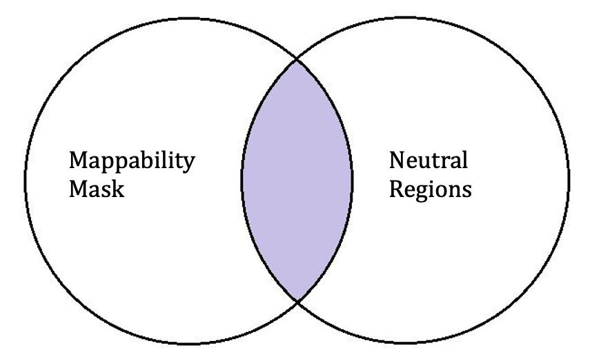

Extract the neutral regions from the reference genome
=====================================================

.. note::

 The main objective of this step is to compute the intersection between the BED intervals derived from the reference genome mappability mask and the BED intervals representing intergenic regions from the corresponding genome annotation file.

1) Set new directories for the neutralome
------------------------------------------

.. code-block:: bash

  mkdir /lustre/scratch/mhoyosro/project1/MSMC2
  cd /lustre/scratch/mhoyosro/project1/MSMC2
  mkdir hipposideros molossus myotis phyllostomus pipistrellus rhinolophus rousettus

2) Get the genomes and the Annotations
----------------------------------------
.. note::

 Reference genome annotations were provided by the Ray Lab at Texas Tech. If annotations are not available, the analysis can still be carried out using only the mappability mask, although this may introduce biases due to sites under selection. To better approximate neutral evolution, we focused on intergenic regions, which are generally less affected by selection. These regions were then intersected with the mappability mask to define high-confidence callable sites, improving the reliability of effective population size estimates.

.. code-block:: bash

  cd /lustre/scratch/mhoyosro/project1/
  cp -r /lustre/scratch/mhoyosro/project3/GENOMES .
  /lustre/scratch/mhoyosro/project3/ANNOTATIONS
  cp *.TOGA.bed /lustre/scratch/mhoyosro/project1/
  cd /lustre/scratch/mhoyosro/project1/
  mkdir ANNOTATIONS
  mv *.bed ANNOTATIONS

3) Get the Neutralomes
----------------------------------------

.. note::

 My TOGA annotations are in BED12 format, so they contain 12 columns. This format includes both gene and transcript intervals. I will use intergenic regions, as they are expected to be closer to neutrality. To do this, we will extract the columns corresponding to genes—specifically, the first six columns—and create a simplified BED file

.. code-block:: bash

	cd /lustre/scratch/mhoyosro/project1/MSMC2/hipposideros
	cut -f1-6 /lustre/scratch/mhoyosro/project1/ANNOTATIONS/mHipLar1.2.pri.TOGA.bed >  hLar_justGENES.bed

	cd /lustre/scratch/mhoyosro/project1/MSMC2/molossus
	cut -f1-6 /lustre/scratch/mhoyosro/project1/ANNOTATIONS/mMolMol1.2.pri.TOGA.bed >  mMol_justGENES.bed

	cd /lustre/scratch/mhoyosro/project1/MSMC2/myotis
	cut -f1-6 /lustre/scratch/mhoyosro/project1/ANNOTATIONS/mMyoMyo1.6.pri.TOGA.bed >  mMyo_justGENES.bed
				
	cd /lustre/scratch/mhoyosro/project1/MSMC2/phyllostomus
	cut -f1-6 /lustre/scratch/mhoyosro/project1/ANNOTATIONS/mPhyDis1.3.pri.TOGA.bed >  pDis_justGENES.bed
	
	cd /lustre/scratch/mhoyosro/project1/MSMC2/pipistrellus
	cut -f1-6 /lustre/scratch/mhoyosro/project1/ANNOTATIONS/mPipKuh1.2.pri.TOGA.bed >  pKuh_justGENES.bed

	cd /lustre/scratch/mhoyosro/project1/MSMC2/rhinolophus
	cut -f1-6 /lustre/scratch/mhoyosro/project1/ANNOTATIONS/mRhiFer1.5.pri.TOGA.bed >  rFer_justGENES.bed

	cd /lustre/scratch/mhoyosro/project1/MSMC2/rousettus
	cut -f1-6 /lustre/scratch/mhoyosro/project1/ANNOTATIONS/mRouAeg1.4.pri.TOGA.bed >  rAeg_justGENES.bed

4) Calculate the scaffold sizes of the reference genome
--------------------------------------------------------
.. code-block:: bash

	. /home/mhoyosro/conda/etc/profile.d/conda.sh
	conda activate alineador

	cd /lustre/scratch/mhoyosro/project1/GENOMES
	
	for file in *.fa; do
	    samtools faidx "$file"
	done

	cd /lustre/scratch/mhoyosro/project1/MSMC2/hipposideros
	cut -f1-2 /lustre/scratch/mhoyosro/project1/GENOMES/mHipLar1.2.pri.fa.fai>  hLar_genomeSIZE

	cd /lustre/scratch/mhoyosro/project1/MSMC2/molossus
	cut -f1-2 /lustre/scratch/mhoyosro/project1/GENOMES/mMolMol1.2.pri.fa.fai > mMol_genomeSIZE

	cd /lustre/scratch/mhoyosro/project1/MSMC2/myotis
	cut -f1-2 /lustre/scratch/mhoyosro/project1/GENOMES/mMyoMyo1.6.pri.fa.fai > mMyo_genomeSIZE

	cd /lustre/scratch/mhoyosro/project1/MSMC2/phyllostomus
	cut -f1-2 /lustre/scratch/mhoyosro/project1/GENOMES/mPhyDis1.3.pri.fa.fai > pDis_genomeSIZE

	cd /lustre/scratch/mhoyosro/project1/MSMC2/pipistrellus
	cut -f1-2 /lustre/scratch/mhoyosro/project1/GENOMES/mPipKuh1.2.pri.fa.fai > pKuh_genomeSIZE

	cd /lustre/scratch/mhoyosro/project1/MSMC2/rhinolophus
	cut -f1-2 /lustre/scratch/mhoyosro/project1/GENOMES/mRhiFer1.5.pri.fa.fai > rFer_genomeSIZE

	cd /lustre/scratch/mhoyosro/project1/MSMC2/rousettus
	cut -f1-2 /lustre/scratch/mhoyosro/project1/GENOMES/mRouAeg1.4.pri.fa.fai > rAeg_genomeSIZE

5) Sort the files
------------------

.. code-block:: bash

	cd /lustre/scratch/mhoyosro/project1/MSMC2/hipposideros
	sort -k1,1 -k2,2n hLar_justGENES.bed > hLar_justGENES.sorted.bed
	sort -k1,1 -k2,2n hLar_genomeSIZE > hLar_sorted.genomeSIZE
 
	cd /lustre/scratch/mhoyosro/project1/MSMC2/molossus
	sort -k1,1 -k2,2n mMol_justGENES.bed > mMol_justGENES.sorted.bed
	sort -k1,1 -k2,2n mMol_genomeSIZE > mMol_sorted.genomeSIZE 
 
	cd /lustre/scratch/mhoyosro/project1/MSMC2/myotis
	sort -k1,1 -k2,2n mMyo_justGENES.bed > mMyo_justGENES.sorted.bed
	sort -k1,1 -k2,2n mMyo_genomeSIZE > mMyo_sorted.genomeSIZE 
 
	cd /lustre/scratch/mhoyosro/project1/MSMC2/phyllostomus
	sort -k1,1 -k2,2n pDis_justGENES.bed > pDis_justGENES.sorted.bed
	sort -k1,1 -k2,2n pDis_genomeSIZE > pDis_sorted.genomeSIZE 
	
	cd /lustre/scratch/mhoyosro/project1/MSMC2/pipistrellus
	sort -k1,1 -k2,2n pKuh_justGENES.bed > pKuh_justGENES.sorted.bed
	sort -k1,1 -k2,2n pKuh_genomeSIZE > pKuh_sorted.genomeSIZE 
 
	cd /lustre/scratch/mhoyosro/project1/MSMC2/rhinolophus
	sort -k1,1 -k2,2n rFer_justGENES.bed > rFer_justGENES.sorted.bed
	sort -k1,1 -k2,2n rFer_genomeSIZE > rFer_sorted.genomeSIZE 
 
	cd /lustre/scratch/mhoyosro/project1/MSMC2/rousettus
	sort -k1,1 -k2,2n rAeg_justGENES.bed > rAeg_justGENES.sorted.bed
	sort -k1,1 -k2,2n rAeg_genomeSIZE > rAeg_sorted.genomeSIZE

6) Merge overlapping gene regions
---------------------------------

.. note::

 bedtools merge combines genes that overlap or are adjacent into a single continuous region.

.. code-block:: bash

	. /home/mhoyosro/conda/etc/profile.d/conda.sh
	conda activate alineador
	
	cd /lustre/scratch/mhoyosro/project1/MSMC2/hipposideros
	bedtools merge -i hLar_justGENES.sorted.bed > hLar_merged_genes.bed
	 
	cd /lustre/scratch/mhoyosro/project1/MSMC2/molossus
	bedtools merge -i mMol_justGENES.sorted.bed > mMol_merged_genes.bed

	cd /lustre/scratch/mhoyosro/project1/MSMC2/myotis
	bedtools merge -i mMyo_justGENES.sorted.bed > mMyo_merged_genes.bed
 
	cd /lustre/scratch/mhoyosro/project1/MSMC2/phyllostomus
	bedtools merge -i pDis_justGENES.sorted.bed > pDis_merged_genes.bed

	cd /lustre/scratch/mhoyosro/project1/MSMC2/pipistrellus
	bedtools merge -i pKuh_justGENES.sorted.bed > pKuh_merged_genes.bed
 
	cd /lustre/scratch/mhoyosro/project1/MSMC2/rhinolophus
	bedtools merge -i rFer_justGENES.sorted.bed > rFer_merged_genes.bed
 
	cd /lustre/scratch/mhoyosro/project1/MSMC2/rousettus
	bedtools merge -i rAeg_justGENES.sorted.bed > rAeg_merged_genes.bed

7) Extend the flanking regions by ~10 kb
-----------------------------------------

.. code-block:: bash

	. /home/mhoyosro/conda/etc/profile.d/conda.sh
	conda activate alineador

	cd /lustre/scratch/mhoyosro/project1/MSMC2/hipposideros
	bedtools slop -i hLar_merged_genes.bed -g hLar_sorted.genomeSIZE -b 10000 > hLar_genes_with_buffer.bed
 
	cd /lustre/scratch/mhoyosro/project1/MSMC2/molossus
	bedtools slop -i mMol_merged_genes.bed -g mMol_sorted.genomeSIZE -b 10000 > mMol_genes_with_buffer.bed

	cd /lustre/scratch/mhoyosro/project1/MSMC2/myotis
	bedtools slop -i mMyo_merged_genes.bed -g mMyo_sorted.genomeSIZE -b 10000 > mMyo_genes_with_buffer.bed
 
	cd /lustre/scratch/mhoyosro/project1/MSMC2/phyllostomus
	bedtools slop -i pDis_merged_genes.bed -g pDis_sorted.genomeSIZE -b 10000 > pDis_genes_with_buffer.bed
	
	cd /lustre/scratch/mhoyosro/project1/MSMC2/pipistrellus
	bedtools slop -i pKuh_merged_genes.bed -g pKuh_sorted.genomeSIZE -b 10000 > pKuh_genes_with_buffer.bed
 
	cd /lustre/scratch/mhoyosro/project1/MSMC2/rhinolophus
	bedtools slop -i rFer_merged_genes.bed -g rFer_sorted.genomeSIZE -b 10000 > rFer_genes_with_buffer.bed

	cd /lustre/scratch/mhoyosro/project1/MSMC2/rousettus
	bedtools slop -i rAeg_merged_genes.bed -g rAeg_sorted.genomeSIZE -b 10000 > rAeg_genes_with_buffer.bed

8) Extract the intergenic regions (part 1)
-------------------------------------------

.. note::
 ``bedtools complement`` identifies genomic regions not covered by the input file (hLar_genes_with_buffer.bed), producing as output the intergenic regions (hLar_intergenic.bed) assuming that intergenic regions are approximately neutral

.. code-block:: bash

	. /home/mhoyosro/conda/etc/profile.d/conda.sh
	conda activate alineador
	
	cd /lustre/scratch/mhoyosro/project1/MSMC2/hipposideros
	bedtools complement -i hLar_genes_with_buffer.bed -g hLar_sorted.genomeSIZE > hLar_intergenic.bed
	 
	cd /lustre/scratch/mhoyosro/project1/MSMC2/molossus
	bedtools complement -i mMol_genes_with_buffer.bed -g mMol_sorted.genomeSIZE > mMol_intergenic.bed
	
	cd /lustre/scratch/mhoyosro/project1/MSMC2/myotis
	bedtools complement -i mMyo_genes_with_buffer.bed -g mMyo_sorted.genomeSIZE > mMyo_intergenic.bed
	 
	cd /lustre/scratch/mhoyosro/project1/MSMC2/phyllostomus
	bedtools complement -i pDis_genes_with_buffer.bed -g pDis_sorted.genomeSIZE > pDis_intergenic.bed

	cd /lustre/scratch/mhoyosro/project1/MSMC2/pipistrellus
	bedtools complement -i pKuh_genes_with_buffer.bed -g pKuh_sorted.genomeSIZE > pKuh_intergenic.bed
	 
	cd /lustre/scratch/mhoyosro/project1/MSMC2/rhinolophus
	bedtools complement -i rFer_genes_with_buffer.bed -g rFer_sorted.genomeSIZE > rFer_intergenic.bed
	 
	cd /lustre/scratch/mhoyosro/project1/MSMC2/rousettus
	bedtools complement -i rAeg_genes_with_buffer.bed -g rAeg_sorted.genomeSIZE > rAeg_intergenic.bed

9) Filter for large regions (≥10 kb)
-----------------------------------------

.. note::
	Very small regions may not be informative for MSMC2, larger regions instead contain enough variants to estimate coalescent rates reducing recombination noise in very short fragments. 
	After performing multiple cuts on the genome as we have done, it is possible that small fragments were created. Therefore, this step makes sense in my view, but proceed carefully with your data if you are following this protocol.
	

.. code-block:: bash
	
	cd /lustre/scratch/mhoyosro/project1/MSMC2/hipposideros
	awk 'BEGIN{OFS="\t"} {if($3-$2 >= 10000) print $1, $2, $3}' hLar_intergenic.bed > hLar_intergenic_min10kb.bed
	 
	cd /lustre/scratch/mhoyosro/project1/MSMC2/molossus
	awk 'BEGIN{OFS="\t"} {if($3-$2 >= 10000) print $1, $2, $3}' mMol_intergenic.bed > mMol_intergenic_min10kb.bed
	
	cd /lustre/scratch/mhoyosro/project1/MSMC2/myotis
	awk 'BEGIN{OFS="\t"} {if($3-$2 >= 10000) print $1, $2, $3}' mMyo_intergenic.bed > mMyo_intergenic_min10kb.bed
	 
	cd /lustre/scratch/mhoyosro/project1/MSMC2/phyllostomus
	awk 'BEGIN{OFS="\t"} {if($3-$2 >= 10000) print $1, $2, $3}' pDis_intergenic.bed > pDis_intergenic_min10kb.bed
	
	cd /lustre/scratch/mhoyosro/project1/MSMC2/pipistrellus
	awk 'BEGIN{OFS="\t"} {if($3-$2 >= 10000) print $1, $2, $3}' pKuh_intergenic.bed > pKuh_intergenic_min10kb.bed
	 
	cd /lustre/scratch/mhoyosro/project1/MSMC2/rhinolophus
	awk 'BEGIN{OFS="\t"} {if($3-$2 >= 10000) print $1, $2, $3}' rFer_intergenic.bed > rFer_intergenic_min10kb.bed
	 
	cd /lustre/scratch/mhoyosro/project1/MSMC2/rousettus
	awk 'BEGIN{OFS="\t"} {if($3-$2 >= 10000) print $1, $2, $3}' rAeg_intergenic.bed > rAeg_intergenic_min10kb.bed

10) Copy the results in the working directories
-----------------------------------------------
		
.. code-block:: bash
	
	cd /lustre/scratch/mhoyosro/project1/MSMC2/hipposideros
	cp hLar_intergenic_min10kb.bed /lustre/scratch/mhoyosro/project1/MSMC2/hLar 
		 
	cd /lustre/scratch/mhoyosro/project1/MSMC2/molossus
	cp mMol_intergenic_min10kb.bed /lustre/scratch/mhoyosro/project1/MSMC2/mMol
		
	cd /lustre/scratch/mhoyosro/project1/MSMC2/myotis
	cp mMyo_intergenic_min10kb.bed /lustre/scratch/mhoyosro/project1/MSMC2/mMyo
		 
	cd /lustre/scratch/mhoyosro/project1/MSMC2/phyllostomus
	cp pDis_intergenic_min10kb.bed /lustre/scratch/mhoyosro/project1/MSMC2/pDis
		
	cd /lustre/scratch/mhoyosro/project1/MSMC2/pipistrellus
	cp pKuh_intergenic_min10kb.bed /lustre/scratch/mhoyosro/project1/MSMC2/pKuh
		 
	cd /lustre/scratch/mhoyosro/project1/MSMC2/rhinolophus
	cp rFer_intergenic_min10kb.bed /lustre/scratch/mhoyosro/project1/MSMC2/rFer
		 
	cd /lustre/scratch/mhoyosro/project1/MSMC2/rousettus
	cp rAeg_intergenic_min10kb.bed /lustre/scratch/mhoyosro/project1/MSMC2/rAeg
	

11) Prepare files for intersect
-----------------------------------------------
		
.. code-block:: bash

	#Create the scaffolds lists 

	cd /lustre/scratch/mhoyosro/project1/MSMC2/hLar/map_mask
	ls *.mask.bed | sed 's/\.mask\.bed$//' > ../scaffolds.txt
	cd /lustre/scratch/mhoyosro/project1/MSMC2/mMol/map_mask
	ls *.mask.bed | sed 's/\.mask\.bed$//' > ../scaffolds.txt
	cd /lustre/scratch/mhoyosro/project1/MSMC2/mMyo/map_mask
	ls *.mask.bed | sed 's/\.mask\.bed$//' > ../scaffolds.txt
	cd /lustre/scratch/mhoyosro/project1/MSMC2/pDis/map_mask
	ls *.mask.bed | sed 's/\.mask\.bed$//' > ../scaffolds.txt
	cd /lustre/scratch/mhoyosro/project1/MSMC2/pKuh/map_mask
	ls *.mask.bed | sed 's/\.mask\.bed$//' > ../scaffolds.txt
	cd /lustre/scratch/mhoyosro/project1/MSMC2/rFer/map_mask
	ls *.mask.bed | sed 's/\.mask\.bed$//' > ../scaffolds.txt
	cd /lustre/scratch/mhoyosro/project1/MSMC2/rAeg/map_mask
	ls *.mask.bed | sed 's/\.mask\.bed$//' > ../scaffolds.txt

	#Create the destination directory for each species

	cd /lustre/scratch/mhoyosro/project1/MSMC2/hLar 
	mkdir masks1
	cd map_mask
	gzip -d *.gz
	cd /lustre/scratch/mhoyosro/project1/MSMC2/mMol
	mkdir masks1
	cd map_mask
	gzip -d *.gz
	cd /lustre/scratch/mhoyosro/project1/MSMC2/mMyo
	mkdir masks1
	cd map_mask
	gzip -d *.gz
	cd /lustre/scratch/mhoyosro/project1/MSMC2/pDis
	mkdir masks1
	cd map_mask
	gzip -d *.gz
	cd /lustre/scratch/mhoyosro/project1/MSMC2/pKuh
	mkdir masks1
	cd map_mask
	gzip -d *.gz
	cd /lustre/scratch/mhoyosro/project1/MSMC2/rFer
	mkdir masks1
	cd map_mask
	gzip -d *.gz
	cd /lustre/scratch/mhoyosro/project1/MSMC2/rAeg
	mkdir masks1
	cd map_mask
	gzip -d *.gz

	

12) Do the intersect
----------------------

A) *Hipposideros larvatus*
~~~~~~~~~~~~~~~~~~~~~~~~~~
		
.. code-block:: bash

	cd /lustre/scratch/mhoyosro/project1/MSMC2/hLar
	ROOT=/lustre/scratch/mhoyosro/project1/MSMC2/hLar
	cd $ROOT

	mapfile -t scaffolds < scaffolds.txt

	for scaffold in "${scaffolds[@]}"; do
	    bedtools intersect \
	    -a $ROOT/hLar_intergenic_min10kb.bed \
	    -b $ROOT/map_mask/${scaffold}.mask.bed > masks1/${scaffold}.mask.bed
	done

B) *Molossus molossus*
~~~~~~~~~~~~~~~~~~~~~~~~~~
		
.. code-block:: bash

	cd /lustre/scratch/mhoyosro/project1/MSMC2/mMol
	ROOT=/lustre/scratch/mhoyosro/project1/MSMC2/mMol
	cd $ROOT

	mapfile -t scaffolds < scaffolds.txt

	for scaffold in "${scaffolds[@]}"; do
  	  bedtools intersect \
 	   -a $ROOT/mMol_intergenic_min10kb.bed \
 	   -b $ROOT/map_mask/${scaffold}.mask.bed > masks1/${scaffold}.mask.bed
	done

C) *Myotis myotis*
~~~~~~~~~~~~~~~~~~~~~~~~~~
		
.. code-block:: bash

	cd /lustre/scratch/mhoyosro/project1/MSMC2/mMyo
	ROOT=/lustre/scratch/mhoyosro/project1/MSMC2/mMyo
	cd $ROOT

	mapfile -t scaffolds < scaffolds.txt

	for scaffold in "${scaffolds[@]}"; do
	    bedtools intersect \
  	  -a $ROOT/mMyo_intergenic_min10kb.bed \
  	  -b $ROOT/map_mask/${scaffold}.mask.bed > masks1/${scaffold}.mask.bed
	done

D) *Phyllostomus discolor*
~~~~~~~~~~~~~~~~~~~~~~~~~~
		
.. code-block:: bash

	cd /lustre/scratch/mhoyosro/project1/MSMC2/pDis
	ROOT=/lustre/scratch/mhoyosro/project1/MSMC2/pDis
	cd $ROOT

	mapfile -t scaffolds < scaffolds.txt

	for scaffold in "${scaffolds[@]}"; do
	    bedtools intersect \
 	   -a $ROOT/pDis_intergenic_min10kb.bed \
 	   -b $ROOT/map_mask/${scaffold}.mask.bed > masks1/${scaffold}.mask.bed
	done

E) *Pipistrellus kuhlii*
~~~~~~~~~~~~~~~~~~~~~~~~~~
		
.. code-block:: bash

	cd /lustre/scratch/mhoyosro/project1/MSMC2/pKuh
	ROOT=/lustre/scratch/mhoyosro/project1/MSMC2/pKuh
	cd $ROOT

	mapfile -t scaffolds < scaffolds.txt

	for scaffold in "${scaffolds[@]}"; do
 	   bedtools intersect \
 	   -a $ROOT/pKuh_intergenic_min10kb.bed \
 	   -b $ROOT/map_mask/${scaffold}.mask.bed > masks1/${scaffold}.mask.bed
	done

F) *Rhinolophus ferrumequinum*
~~~~~~~~~~~~~~~~~~~~~~~~~~~~~~~
		
.. code-block:: bash

	cd /lustre/scratch/mhoyosro/project1/MSMC2/rFer
	ROOT=/lustre/scratch/mhoyosro/project1/MSMC2/rFer
	cd $ROOT
	
	mapfile -t scaffolds < scaffolds.txt

	for scaffold in "${scaffolds[@]}"; do
	    bedtools intersect \
	    -a $ROOT/rFer_intergenic_min10kb.bed \
	    -b $ROOT/map_mask/${scaffold}.mask.bed > masks1/${scaffold}.mask.bed
	done

G) *Rousettus aegyptiacus*
~~~~~~~~~~~~~~~~~~~~~~~~~~~~~~~
		
.. code-block:: bash

	cd /lustre/scratch/mhoyosro/project1/MSMC2/rAeg
	ROOT=/lustre/scratch/mhoyosro/project1/MSMC2/rAeg
	cd $ROOT

	mapfile -t scaffolds < scaffolds.txt

	for scaffold in "${scaffolds[@]}"; do
 	   bedtools intersect \
 	   -a $ROOT/rAeg_intergenic_min10kb.bed \
  	  -b $ROOT/map_mask/${scaffold}.mask.bed > masks1/${scaffold}.mask.bed
	done

12) Combine the .bed mask files because they are generated separately and come out fragmented.
-----------------------------------------------------------------------------------------------

cd /lustre/scratch/mhoyosro/project1/MSMC2/hLar
cat masks1/*.bed > combined_neutral.bed

cd /lustre/scratch/mhoyosro/project1/MSMC2/mMol
cat masks1/*.bed > combined_neutral.bed

cd /lustre/scratch/mhoyosro/project1/MSMC2/mMyo
cat masks1/*.bed > combined_neutral.bed

cd /lustre/scratch/mhoyosro/project1/MSMC2/pDis
cat masks1/*.bed > combined_neutral.bed

cd /lustre/scratch/mhoyosro/project1/MSMC2/pKuh
cat masks1/*.bed > combined_neutral.bed

cd /lustre/scratch/mhoyosro/project1/MSMC2/rFer
cat masks1/*.bed > combined_neutral.bed

cd /lustre/scratch/mhoyosro/project1/MSMC2/rAeg
cat masks1/*.bed > combined_neutral.bed

